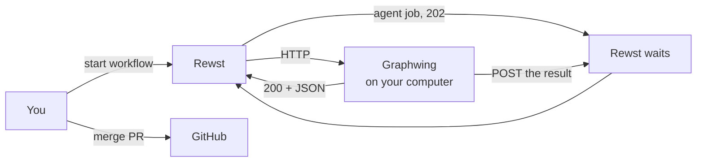

# Graphwing

Rewst workflows run in the cloud. They cannot `git checkout` a repo on your disk, cannot run your local test command, and cannot start Hermes. Graphwing is a small HTTP server on the computer where those repos live. Rewst calls it.

That is the product.

## Why bother

One chat session that writes code, runs git, judges its own work, and opens a PR is a mess. Graphwing splits the jobs:

- **Rewst** stores the order of steps. Checkout, then one agent, then test, then commit. That order is a workflow JSON file in `graphs/`.
- **Graphwing** performs each step when Rewst hits a URL (`/v1/git/checkout`, `/v1/test/run`, `/v1/agent/run`, …).
- **You** still decide what to build, write the ticket files, start the workflow, and merge the PR.

Cloud GitHub and Shortcut stay Rewst's integrations. Graphwing does not hold those keys. Visual evidence uses Rewst's GitHub integration to attach durable artifact references and comment on the issue; the laptop receives no GitHub credential.



<p align="center">
  
</p>

Rewst cannot call `127.0.0.1`, so a Cloudflare tunnel gives Graphwing a public URL. Import that `/openapi.json` as a Rewst custom integration.

## A workflow run

You start a published workflow with a JSON body. Example: which repo (a short name like `riftwing`, not a path), which branch, which ticket markdown file, which test.

Rewst walks its step list:

1. Short calls return immediately. `gitStatus`, `testRun`, `fileHead` of the ticket file.
2. `agentRun` is slow. Graphwing starts one Hermes or Claude job and returns 202. Rewst waits on a callback URL. When the job ends, Graphwing POSTs `{ status, summary, sha, … }` and Rewst continues.
3. If tests fail, files stay on disk. Graphwing does not `git restore`. After a few failed retries it stops and waits for you.
4. If the ticket is done, Graphwing commits and pushes. The workflow then POSTs *itself* with the next ticket. That is a new run. Rewst will not let one run loop forever.

The agent sees only that ticket file. It does not see the grill chat or the rest of the epic.

<p align="center">
  
</p>

If a step is a plain command, give it its own URL. Do not fold it into the agent.

## Workflows in this repo

| Workflow | You pass | It does |
|---|---|---|
| `graphwing-implement-slice` | repo, branch, ticket path, test | One ticket: code, test, review, commit. Then start the next ticket. |
| `graphwing-visual-evidence` | build id, event id, optional reviewer | One bounded pre-commit real-browser evidence round: stable preview, capture/inspect/one recapture, automated UI review, durable artifact handoff, GitHub issue comment, and optional planning-pane prompt. The preview stays running. |
| `graphwing-visual-iteration` | build id, event id, one feedback, decision, return, or resume action | One bounded design turn. It records exact feedback, resumes the saved writer, reruns changed-area checks and typecheck, composes a real-browser evidence round, and reports the verified candidate to the exact planning pane. Turn 20 is a one-time checkpoint, not a ceiling. |
| `graphwing-verify-stack` | stack, ports | Check that a local stack is up. |
| `graphwing-pr-lifecycle` | build id, unique event id, event, PR identity, optional close choice | Records/replays the bounded PR lifecycle receipt; only recorded preview resources can be reclaimed. |
| `graphwing-pr-status` | PR number | Read GitHub checks. No writes. |
| `graphwing-pr-drive` | repo, PR, test | One fix attempt when CI is red. |

How you sit down and start a run: [docs/USING.md](docs/USING.md). Rules for the human: [docs/HUMAN-LOOP.md](docs/HUMAN-LOOP.md).

## What lives where

| Place | Contents |
|---|---|
| This git repo | Server, OpenAPI spec, workflow JSON, docs |
| `~/.graphwing` | API key, tunnel token, jobs, Hermes state. Never commit this. |

`repos.json` in that home directory maps short names (`riftwing`) to real paths. Graphwing refuses anything else.

## Install

```bash
git clone https://github.com/tfournet/graphwing.git
cd graphwing
./start.sh
```

Optional flags: `--yes --with-hermes`, `--no-start`, `--daemon`.

The API listens on `127.0.0.1:8645`. Send `X-Graphwing-Key` from `$GRAPHWING_HOME/api.key`. `/v1/health` and `/openapi.json` need no key. `GET /v1/watch` is the bar snapshot (units + jobs); it needs the key.

On Omarchy, `install.py` copies `plugins/graphwing.watch/` onto the right side of the bar. The widget polls that endpoint.

```bash
GRAPHWING_HOME=. python3 test_server.py
```

Git write endpoints only work on those short names. No `--force`. No `git add -A` unless you pass paths. Tests and scripts are allowlisted names in `tests.json` / `scripts.json`.

Publish workflows after you have `$GRAPHWING_HOME/rewst-install.json` and a Rewst MCP token:

```bash
python3 scripts/publish_graphs.py --only all --no-run
```

Do not install this on Rewst Internal. Do not ship it as a Rewst platform package.
