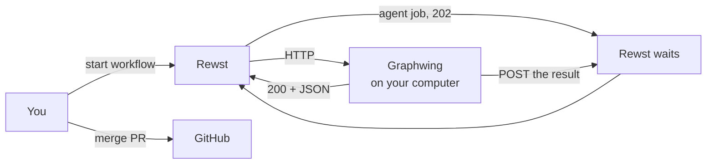
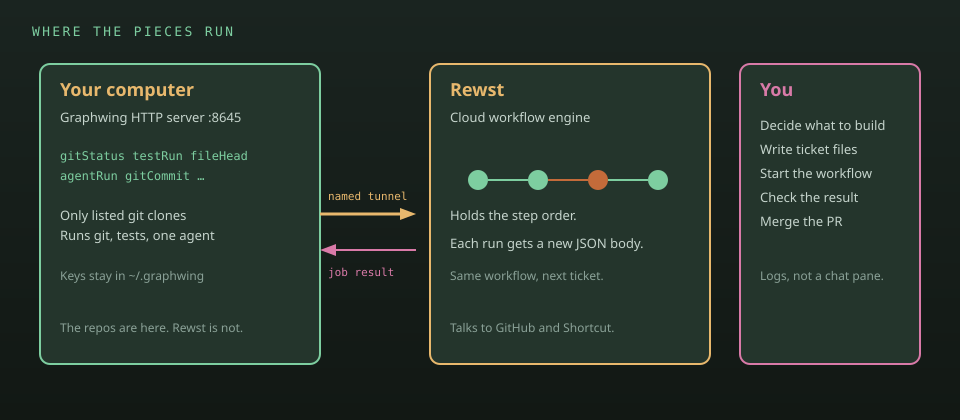
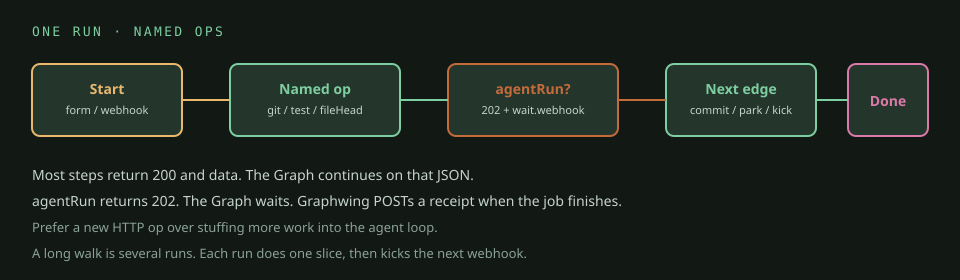

# Graphwing

Rewst workflows run in the cloud. They cannot `git checkout` a repo on your disk, cannot run your local test command, and cannot start native model launchers. Graphwing is a small HTTP server on the computer where those repos live. Rewst calls it.

That is the product.

## Why bother

One chat session that writes code, runs git, judges its own work, and opens a PR is a mess. Graphwing splits the jobs:

- **Rewst** stores the order of steps. Checkout, then one agent, then test, then commit. That order is a workflow JSON file in `graphs/`.
- **Graphwing** performs each step when Rewst hits a URL (`/v1/git/checkout`, `/v1/test/run`, `/v1/agent/run`, …).
- **You** still decide what to build, write the ticket files, start the workflow, and merge the PR.

Cloud issue and pull-request operations stay in Rewst integrations. Graphwing does not hold those keys.



<p align="center">
  
</p>

*Topology-only: webhook starts are known-disabled; use the documented manual/form/API starts for `implement-slice` and `pr-drive`, and the API start for `pr-status`.*

Rewst cannot call `127.0.0.1`, so a Cloudflare tunnel gives Graphwing a public URL. Import that `/openapi.json` as a Rewst custom integration.

## A workflow run

You start a published workflow with a JSON body. Example: which repo (a short name like `riftwing`, not a path), which branch, which ticket markdown file, which test.

Rewst walks its step list:

1. Short calls return immediately. `gitStatus`, `testRun`, `fileHead` of the ticket file.
2. `agentRun` is slow. Graphwing starts one native Codex, Claude, or Grok job and returns 202. Rewst waits on a callback URL. When the job ends, Graphwing POSTs `{ status, summary, sha, … }` and Rewst continues.
3. If tests fail, files stay on disk. Graphwing does not `git restore`. After a few failed retries it stops and waits for you.
4. If the ticket is done, Graphwing commits and pushes. The catalog has a fresh-run `kick_url` edge, but the current webhook-to-`CTX.INPUT` mapping is broken; start the next bounded slice manually or through the API.

The agent sees only that ticket file. It does not see the grill chat or the rest of the epic.

<p align="center">
  
</p>

If a step is a plain command, give it its own URL. Do not fold it into the agent.

## Workflows in this repo

| Workflow | You pass | It does |
|---|---|---|
| `graphwing-run-control-authorize` | `record_key`, `server_instance_challenge` | Inert foundation helper: native exact durable-record readback/hash binding, exact descriptor/challenge input gate, and challenge-bound one-time issued-to-consumed KV CAS. Existing launch graphs do not call it yet. |
| `graphwing-run-control-transition` | `expected_pointer_version`, `from_logical_revision`, `operation_id`, `operation_type`, `owner_workflow_run_id`, `run_control_id`, `target_logical_revision`, `target_state`, `target_state_record_key`, `target_state_sha256`, `transition_delta`, `transition_request_sha256` | Dormant content-addressed Records plus KV CAS journal transition/recovery helper; pending is fail-closed and cannot launch. |
| `graphwing-run-control-initialize` | `budgets`, `evaluator_contract_sha256`, `initial_route`, `root_identity` | Dormant immutable-budget initializer with an explicit closed root identity, non-path hashed run/state identities, and an exactly pinned transition child. |
| `graphwing-run-control-state` | `branch`, `callback_binding_sha256`, `candidate_route`, `endpoint`, `exact_request_body_sha256`, `handoff`, `head_sha`, `launcher_fingerprint`, `next_envelope`, `permission_profile`, `repository`, `run_control_id`, `task_sha256` | Dormant verified-state evaluator/challenge controller that consumes the propagated run-control ID and persists at most one reservation or a terminal result; it has no launch edge. |
| `graphwing-run-control-reconcile` | `authority_loss_reason`, `kind`, `receipt`, `run_control_id` | Dormant exact terminal-receipt or conservative full-envelope authority-loss reconciliation. |
| `graphwing-run-control-consume-authorization` | `attempt_id`, `authorization_id`, `launch_descriptor_sha256`, `server_instance_challenge`, `state_record_key`, `state_sha256` | Dormant exact issued-to-consumed authorization CAS helper. |
| `graphwing-run-control-consume` | `run_control_id` | Dormant controller that verifies one outstanding reservation, consumes authority, and persists consumed state without launching. |
| `graphwing-implement-slice` | `repo`, `branch`, `index`, `ticket`, `commit_message`, `test`, `iters_left`, `class`, `work_kind`, `size`, `ac_count`, `seams`, `kick_url`, `kick_token`, `e2e`, `recovery_version`, `prior_primary_route`, `prior_primary_receipt`, `prior_fallback_route`, `prior_fallback_receipt`, `fresh_primary_receipt` | One ticket: route, write, named test, opposing review, complete, commit, push. `diagnostic-v1` receipts are bounded; `provider-recovery-v1` is a later-invocation evidence check, never an active-session switch. |
| `graphwing-verify-stack` | `stack`, `port` | Check the stack then one port and retain compact diagnostics. |
| `graphwing-pr-drive-run-control` | `repo`, `pr_number`, `attempt`, `max_attempts`, `auto_merge`, `kick_url`, `kick_token`, `test`, `class`, `size`, `work_kind`, `prompt`, `commit_message`, `run_control` | dormant run-control sibling of pr-drive: same topology; the writer launches under the carried reservation and settles it from the live `wait` body via `/v1/run/control/settle` → pinned reconcile; the continue leg fingerprints its kick, reserves, consumes, kicks with four-field continuity, and closes a failed kick as authority loss; API start only; `run_control` is the four-field continuity; published with `--only all` or by name, never with `--only pr-drive` |
| `graphwing-pr-status` | `pr` | Read remote-only PR state through an API start. Webhook starts remain disabled. |
| `graphwing-pr-drive` | `repo`, `pr_number`, `attempt`, `max_attempts`, `auto_merge`, `kick_url`, `kick_token`, `test`, `class`, `size`, `work_kind`, `prompt`, `commit_message` | On red, make one bounded fix. Every remote-ready path runs one final persisted, head-bound named test before optional merge. |
| `graphwing-code-off` | `experiment_id`, `repo`, `base_sha`, `seed`, `category`, `tags`, `category_source`, `prompt`, `tests`, `toolchain`, `budgets`, `commit_message` | Deterministic bounded DAG with two frozen candidates and three blind judgments; only an exact test-green winner can reach commit/push. No redraw, fallback, cycle, or merge. |

The exact catalog input sets are in [graphs/README.md](graphs/README.md). How you sit down and start a run: [docs/USING.md](docs/USING.md). Rules and proof levels: [docs/HUMAN-LOOP.md](docs/HUMAN-LOOP.md).

## What lives where

| Place | Contents |
|---|---|
| This git repo | Server, OpenAPI spec, workflow JSON, docs |
| `~/.graphwing` | API key, tunnel token, jobs, local runtime state. Never commit this. |

`repos.json` in that home directory maps short names (`riftwing`) to real paths. Graphwing refuses anything else.

## Install

```bash
git clone https://github.com/tfournet/graphwing.git && cd graphwing && ./start.sh
```

Optional flags: `--yes`, `--with-herdr`, `--with-cloudflared`, `--no-start`, `--daemon`. Install `codex`, `claude`, or `grok` separately before selecting that launcher.

The API listens on `127.0.0.1:8645`. Send `X-Graphwing-Key` from `$GRAPHWING_HOME/api.key`. `/v1/health` and `/openapi.json` need no key. `GET /v1/watch` is the bar snapshot (units + jobs); it needs the key.

On Omarchy, `install.py` runs `~/work/graphwing.watch/install.py` when that checkout exists. The widget polls `/v1/watch`.

```bash
GRAPHWING_HOME=. python3 test_server.py
```

Git write endpoints only work on those short names. No `--force`. No `git add -A` unless you pass paths. Tests and scripts are allowlisted names in `tests.json` / `scripts.json`.

Code-off state is a hash-chained, content-addressed record under `$GRAPHWING_HOME/codeoffs`; audit exposes the seed commitment but never the seed or blind map. Candidate/final tests use the same disposable Git-worktree recipe, and only a verified hash is safely applied. `approved-model-manifest-v2` makes the six exact native identities eligible, including Terra and Fable only through immutable code-off snapshots; ordinary launcher model lists are unchanged. Its bounded catalog inventory and canary evidence was obtained on 2026-08-26, not by continuous discovery: “latest” means approved latest at policy creation, and expiration parks new runs pending reviewed policy update. There is no dynamic provider discovery, OpenCode dependency, alias, substitution, fallback, or redraw. This change and its fixtures do not claim that a live Rewst code-off was run or published. Git worktrees are not OS isolation.

PR merge safety requires the persisted final named-test job plus a fresh open/non-draft, stable-head, merge-ready PR and a nonempty terminal-green GitHub check set. `pr-status`, earlier tests, and code-off receipts cannot waive that gate. This catalog has no visual-proof workflow. Local fixtures or catalog parsing do not establish Rewst import parity, publication, live readiness, or a canary.

Publish workflows after you have `$GRAPHWING_HOME/rewst-install.json` and a Rewst MCP token:

```bash
python3 scripts/publish_graphs.py --only all --no-run
```

Do not install this on Rewst Internal. Do not ship it as a Rewst platform package.

rc-validation stub edit 2026-09-02T03:08:12Z

rc-validation stub edit 2026-09-02T03:09:43Z
