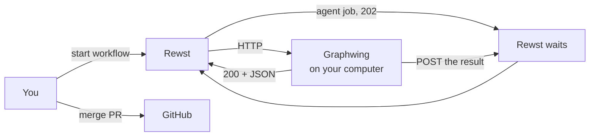

# Graphwing

Rewst workflows run in the cloud. They cannot `git checkout` a repo on your disk, cannot run your local test command, and cannot start native model launchers. Graphwing is a small HTTP server on the computer where those repos live. Rewst calls it.

That is the product.

## Why bother

One chat session that writes code, runs git, judges its own work, and opens a PR is a mess. Graphwing splits the jobs:

- **Rewst** owns business policy, durable workflow state, and the order of steps. The complete boundary is [docs/ARCHITECTURE.md](docs/ARCHITECTURE.md).
- **Graphwing** reports normalized facts and performs bounded local effects when Rewst hits a named URL (`/v1/git/checkout`, `/v1/test/run`, `/v1/agent/run`, …). It enforces non-bypassable safety but does not choose product policy.
- **You** decide what to build, approve the workflow intent, and authorize whether merge may be automatic.

Cloud issue and Shortcut operations stay in Rewst integrations. Graphwing may use the seat's allowlisted local `gh` executable for normalized PR facts and an exact workflow-authorized merge; credentials never enter workflow data.



<p align="center">
  
</p>

*Topology-only: webhook starts are known-disabled; use the documented manual/form/API starts for `implement-slice` and `pr-drive`, and the API start for `pr-status`.*

Rewst cannot call `127.0.0.1`, so a Cloudflare tunnel gives Graphwing a public URL. Import that `/openapi.json` as a Rewst custom integration.

## A workflow run

You start a published workflow with a JSON body. Example: which repo (a short name like `riftwing`, not a path), which branch, which ticket markdown file, which test.

Rewst walks its step list:

1. Short calls return immediately. `gitStatus`, `testRun`, `fileHead` of the ticket file.
2. `agentRun` is slow. Graphwing starts one native Codex, Claude, or Grok job and returns 202. Rewst waits on a callback URL. When the job ends, Graphwing POSTs `{ status, summary, sha, … }` and Rewst continues.
3. If tests fail, files stay on disk. Graphwing does not `git restore`. After a few failed retries it stops and waits for you.
4. If the ticket is done, Graphwing commits and pushes. The catalog has a fresh-run `kick_url` edge, but the current webhook-to-`CTX.INPUT` mapping is broken; start the next bounded slice manually or through the API.

The agent sees only that ticket file. It does not see the grill chat or the rest of the epic.

<p align="center">
  
</p>

If a step is a plain command, give it its own URL. Do not fold it into the agent.

## Workflows in this repo

| Workflow | You pass | It does |
|---|---|---|
| `graphwing-routing-policy` | `class`, `work_kind`, `size`, `ac_count`, `seams` | Build one deterministic native `workflow-normal-v1` routing decision and complete `route-execution-profile-v2` objects. `implement-slice` and `pr-drive` call its exact published workflow/version for primary writers and routed reviews. Invalid closed inputs hard-fail. |
| `graphwing-run-control-authorize` | `record_key`, `run_control_id`, `server_instance_challenge`, `state_version` | Compatibility-only foundation helper. It remains cataloged but no source `action.subworkflow` or `pr-drive` publication chain references it. |
| `graphwing-run-control-transition` | `commit_kind`, `expected_pointer_version`, `from_logical_revision`, `operation_id`, `operation_type`, `owner_workflow_run_id`, `previous_record_sha256`, `run_control_id`, `state_version`, `target_logical_revision`, `target_ordinal`, `target_pointer`, `target_pointer_sha256`, `target_record`, `target_record_key`, `target_record_sha256`, `target_state`, `target_state_record_key`, `target_state_sha256`, `transition_delta`, `transition_request_sha256` | Active v1 content-addressed Records plus KV CAS journal transition/recovery helper; pending is fail-closed and cannot launch. |
| `graphwing-run-control-initialize` | `budgets`, `evaluator_contract_sha256`, `initial_route`, `root_identity`, `state_version` | Compatibility v1 plus v2 immutable-history initialization. `drive-pr.py` no longer initializes or mints policy inputs. |
| `graphwing-run-control-state` | `branch`, `callback_binding_sha256`, `candidate_route`, `decision_only`, `endpoint`, `exact_request_body_sha256`, `handoff`, `head_sha`, `launcher_fingerprint`, `next_envelope`, `owner_workflow_run_id`, `permission_profile`, `repository`, `run_control_id`, `state_version`, `task_sha256`, `verified` | The v2 lane computes budget, gaming, size, checkpoint, handoff, park, exhaustion, and terminal policy with native nodes; the daemon evaluator remains reachable only from the v1 compatibility lane. |
| `graphwing-run-control-reconcile` | `attempt_job_id`, `authority_loss_reason`, `authorization_identity`, `kind`, `owner_workflow_run_id`, `progress`, `receipt`, `reserved_envelope`, `run_control_id`, `state_version` | Active v1 exact terminal-receipt or conservative full-envelope authority-loss reconciliation. |
| `graphwing-run-control-consume-authorization` | `attempt_id`, `authorization_id`, `launch_descriptor_sha256`, `server_instance_challenge`, `state_record_key`, `state_sha256` | Active v1 authorization child. The publisher resolves `consume`'s `AUTHORIZE` pin to this exact six-input graph. |
| `graphwing-run-control-consume` | `descriptor_preparation`, `expires_at`, `issued_at`, `run_control_id`, `state_version` | V2 reconstructs the exact launch descriptor, persists and reads back issuance, consumes one CAS authorization, and returns the complete `RewstConsumedAuthorization`; v1 remains compatible. |
| `graphwing-implement-slice` | `repo`, `branch`, `index`, `ticket`, `commit_message`, `test`, `iters_left`, `class`, `work_kind`, `size`, `ac_count`, `seams`, `kick_url`, `kick_token`, `e2e`, `recovery_version`, `prior_primary_route`, `prior_primary_receipt`, `prior_fallback_route`, `prior_fallback_receipt`, `fresh_primary_receipt` | One ticket: exact-pinned workflow route, write, named test, opposing review, complete, commit, push. Initial writers/reviewers use v2 profiles; corrections reuse the successful receipt identity. Fallback/recovery remain on their v1 compatibility surfaces. |
| `graphwing-verify-stack` | `stack`, `port` | Check the stack then one port and retain compact diagnostics. |
| `graphwing-pr-status` | `pr` | Read remote-only PR state through an API start. Native nodes classify raw PR, stable-head, label, review, merge-state, and normalized-check facts into closed readiness reasons. Webhook starts remain disabled. |
| `graphwing-pr-drive` | `repo`, `pr_number`, `auto_merge`, `test`, `class`, `size`, `work_kind`, `prompt`, `commit_message`, `run_control_id` | One bounded lifecycle decision over the same durable v2 run. Native policy owns correction lifecycle, pre-wait final readiness, fresh post-test eligibility, and explicit human/requested merge intent. Every non-ready final state terminates before callback wait; successful exact-head verification is followed by fresh stable-head facts before merge intent. |
| `graphwing-code-off` | `experiment_id`, `repo`, `base_sha`, `seed`, `category`, `tags`, `category_source`, `prompt`, `tests`, `toolchain`, `budgets`, `commit_message` | Deterministic bounded DAG with two frozen candidates and three blind judgments; only an exact test-green winner can reach commit/push. No redraw, fallback, cycle, or merge. |

The exact catalog input sets are in [graphs/README.md](graphs/README.md). How you sit down and start a run: [docs/USING.md](docs/USING.md). Rules and proof levels: [docs/HUMAN-LOOP.md](docs/HUMAN-LOOP.md).

The source-derived run-control ownership inventory, v1/v2 migration rule, and approval gates are pinned in [docs/notes/run-control-activation-recovery.md](docs/notes/run-control-activation-recovery.md#issue-187-ownership-and-call-path-baseline).

## What lives where

| Place | Contents |
|---|---|
| This git repo | Server, OpenAPI spec, workflow JSON, docs |
| `~/.graphwing` | API key, tunnel token, jobs, local runtime state. Never commit this. |

`repos.json` in that home directory maps short names (`riftwing`) to real paths. Graphwing refuses anything else.

## Install

```bash
git clone https://github.com/tfournet/graphwing.git && cd graphwing && ./start.sh
```

Optional flags: `--yes`, `--with-herdr`, `--with-cloudflared`, `--no-start`, `--daemon`. Install `codex`, `claude`, or `grok` separately before selecting that launcher.

The API listens on `127.0.0.1:8645`. Send `X-Graphwing-Key` from `$GRAPHWING_HOME/api.key`. `/v1/health` and `/openapi.json` need no key. `GET /v1/watch` is the bar snapshot (units + jobs); it needs the key.

On Omarchy, `install.py` runs `~/work/graphwing.watch/install.py` when that checkout exists. The widget polls `/v1/watch`.

```bash
GRAPHWING_HOME=. python3 test_server.py
```

Git write endpoints only work on those short names. No `--force`. No `git add -A` unless you pass paths. Tests and scripts are allowlisted names in `tests.json` / `scripts.json`.

Code-off state is a hash-chained, content-addressed record under `$GRAPHWING_HOME/codeoffs`; audit exposes the seed commitment but never the seed or blind map. Candidate/final tests use the same disposable Git-worktree recipe, and only a verified hash is safely applied. `approved-model-manifest-v2` makes the six exact native identities eligible, including Terra and Fable only through immutable code-off snapshots; ordinary launcher model lists are unchanged. Its bounded catalog inventory and canary evidence was obtained on 2026-08-26, not by continuous discovery: “latest” means approved latest at policy creation, and expiration parks new runs pending reviewed policy update. There is no dynamic provider discovery, OpenCode dependency, alias, substitution, fallback, or redraw. This change and its fixtures do not claim that a live Rewst code-off was run or published. Git worktrees are not OS isolation.

Final named-test admission validates bounded execution identity and evidence, not merge eligibility. PR merge safety separately requires explicit authorization, the persisted exact run/repo/recipe/head final-test job, matching writer mode, a fresh open/non-draft stable head, `MERGEABLE`/`CLEAN`, no hold or review block, and a nonempty terminal-green GitHub check set. `pr-status`, earlier tests, workflow conclusions, and code-off receipts cannot waive that gate. This catalog has no visual-proof workflow. Local fixtures or catalog parsing do not establish Rewst import parity, publication, live readiness, or a canary.

Publish workflows after you have `$GRAPHWING_HOME/rewst-install.json` and a Rewst MCP token:

```bash
python3 scripts/publish_graphs.py --only all --no-run
```

Do not install this on Rewst Internal. Do not ship it as a Rewst platform package.
