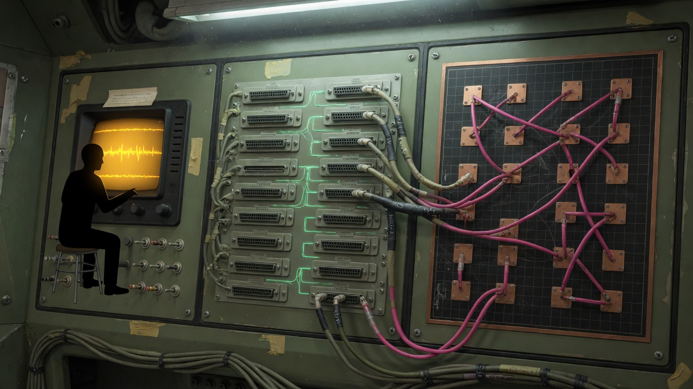

# Graphwing

<p align="center">
  
</p>

Graphwing is a **local node catalog** for [Rewst Graph](https://rewst.io). It runs on the machine that has the git checkouts. Rewst holds the workflow map. This repo is the list of named HTTP operations that map can call: git, tests, one bounded agent job. It is not a mega-agent and not Rewst Internal.

You grill ideas in Herdr. Graph runs the map. You prove the result and merge the PR.

<p align="center">
  
</p>

| Piece | Job |
|---|---|
| This git repo | Source of truth for ops (`server.py`, `openapi.json`) and workflow JSON (`graphs/`) |
| `~/.graphwing` | Runtime. API key, tunnel, jobs, Hermes state. Do not commit it. |
| Rewst Graph | Published topology. A run is `{ "input": { … } }`. Same map, new payload. |
| Named tunnel | Public URL so Rewst can reach this host. Loopback is blocked. |

Cloud GitHub and Shortcut stay Rewst integrations. This seat does not hold those keys.

## How a run works

Most steps are a short HTTP call (`gitStatus`, `testRun`, `fileHead`, …) and a 200 with JSON. The Graph follows the next edge.

`agentRun` is the long one. It returns 202. The Graph waits on a webhook. When the job finishes, Graphwing POSTs a receipt. That is how a coding loop joins without living inside Rewst.

```mermaid
%%{init: {
  "theme": "base",
  "themeVariables": {
    "primaryColor": "#24352c",
    "primaryTextColor": "#e8efe9",
    "primaryBorderColor": "#7dcea0",
    "lineColor": "#e8b86d",
    "secondaryColor": "#1a2420",
    "tertiaryColor": "#121814",
    "background": "#121814",
    "mainBkg": "#24352c",
    "nodeBorder": "#7dcea0",
    "clusterBkg": "#1a2420",
    "titleColor": "#7dcea0",
    "edgeLabelBackground": "#1a2420",
    "fontFamily": "ui-sans-serif, system-ui, sans-serif"
  }
}}%%
flowchart LR
  A["Start<br/>form or webhook"] --> B["Named op<br/>200 + data"]
  B --> C{"agentRun?"}
  C -->|no| D["Next edge"]
  C -->|yes| E["Wait webhook"]
  E --> F["Catalog POSTs receipt"]
  F --> D
  D --> G["Commit, park, or kick next run"]
  style A fill:#24352c,stroke:#e8b86d,color:#e8b86d
  style B fill:#24352c,stroke:#7dcea0,color:#7dcea0
  style C fill:#24352c,stroke:#c46b3a,color:#e8b86d
  style E fill:#24352c,stroke:#c46b3a,color:#c46b3a
  style F fill:#24352c,stroke:#d97aa8,color:#d97aa8
  style D fill:#24352c,stroke:#7dcea0,color:#7dcea0
  style G fill:#24352c,stroke:#d97aa8,color:#d97aa8
```

<p align="center">
  
</p>



A long walk is **several runs**. One run does one slice, then POSTs this workflow’s webhook with the next ticket. Rewst rejects unbounded cycles inside a single run.

Prefer a new deterministic op over stuffing more work into `agentRun`.

## Published maps

| Slug | Input | What it does |
|---|---|---|
| `graphwing-implement-slice` | repo, branch, index, ticket, test, … | One ticket: write, test, review, commit. Kick the next. |
| `graphwing-verify-stack` | stack, ports | Is the stack up. |
| `graphwing-pr-status` | pr | Read-only checks. |
| `graphwing-pr-drive` | repo, pr, test, prompt | One fix slice when CI is red. |

Human loop: [docs/HUMAN-LOOP.md](docs/HUMAN-LOOP.md). How to fire a run: [docs/USING.md](docs/USING.md). Graph JSON: [graphs/README.md](graphs/README.md).

## Install

```bash
git clone https://github.com/tfournet/graphwing.git
cd graphwing
./start.sh
```

`start.sh` can install Hermes Agent, herdr, and cloudflared, write `$GRAPHWING_HOME`, and start the API. It does not copy secrets from another machine. It does not install `rr`.

```bash
./start.sh --yes --with-hermes
./start.sh --yes --no-start
./start.sh --daemon
```

- **API key:** `$GRAPHWING_HOME/api.key` (mode 600) or `GRAPHWING_KEY`. Header `X-Graphwing-Key`. Health and `/openapi.json` are open.
- **Repos:** `$GRAPHWING_HOME/repos.json`. Graph uses short names, not paths. See `examples/repos.example.json`.
- **Tunnel:** default is loopback `127.0.0.1:8645`. `named` needs `tunnel.env` or `GRAPHWING_CF_API_KEY` and writes `cloudflared-meta.json`. Rewst cannot import a loopback OpenAPI URL.
- **Human:** `herdr --session graphwing`. One idea = one space (`graphwing-idea open --label NAME --repo riftwing`). Tab `graph` is logs. Do not grill there.

```bash
GRAPHWING_HOME=. python3 test_server.py
```

Git writes are opt-in on allowlisted short names. No `--force`. No `git add -A` unless paths are explicit. `scriptRun` / `testRun` are allowlisted names only.

## Rewst

Import the custom integration from the public OpenAPI URL (`servers[0].url` or `GRAPHWING_PUBLIC_URL`). Then publish maps:

```bash
# $GRAPHWING_HOME/rewst-install.json from examples/rewst-install.example.json
# MCP token: GRAPHWING_REWST_MCP_TOKEN, or mcp_bws_key + BWS_ACCESS_TOKEN
python3 scripts/publish_graphs.py --only all --no-run
```

Do not install this on Rewst Internal. Do not ship it as a platform package.
